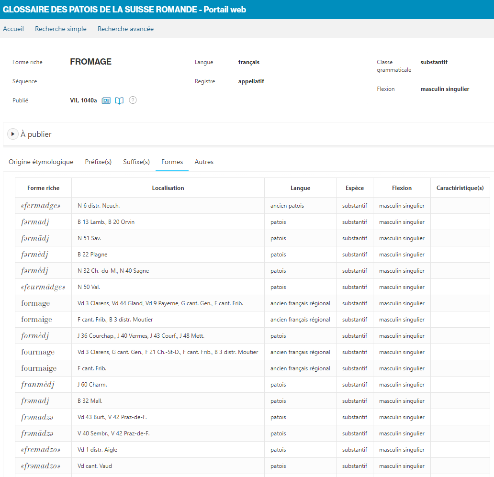

# UNIGE-DH-GPSR-ATLAS

Prototype d'atlas linguistique des formes pour le Glossaire des patois de la Suisse romande

But : Cartographie dialectale
* Valorisation des formes (variantes phonétiques)
* Permettre l'étude des variations linguistiques selon l'axe géographique (en opposition avec la lecture des articles nécessitant une interprétation de ceux-ci)

Projet réalisé dans le cadre du cours Unige-DH-Visualisation-2021

## Contexte
L'application [Web](https://portail-gpsr.unine.ch) du Glossaire des patois de la Suisse romande documente les lemmes et leurs formes dans les patois, les langues anciennes et le français régional de la Suisse romande.
Chaque forme est mentionnée avec ses localisations, plus ou moins précises. Les formes patoises sont généralement référencées dans des communes ou hameaux. Certaines formes, dont les formes anciennes ou régionales, ont une localisation plus vague, comme un district, une région ou un canton. Une forme référencée dans un canton n'indique pas que cette forme est utilisée dans tout le canton, mais plutôt qu'elle a été recensée dans le canton mais à un emplacement précis inconnu.

Figure 1 - Formes du lemme FROMAGE et ses différentes localisations selon la nomenclature du GPSR

## Contenu du prototype

* Affichage des variantes phonétiques (formes) du lemme FROMAGE sur une carte de la Suisse romande
* Les formes patoises sont affichées dans leur police grasse penchée, les autres sont en romain
* Les formes dont l'emplacement géographique est une commune ou un hameau :
	* sont affichées à leur emplacement géographique
	* leur localisation (selon le GPSR) est affichable dans une info-bulle sur l'icône "i"
	* sont regroupées dans un "cluster" pour un même emplacement géographique (avec une forme affichée par défaut)
* Les formes dont la provenance géographique est inconnue ou trop vague (un district, un canton, une région) sont affichables en cliquant sur le drapeau cantonal. 
* Les langues des formes servent de critères d'affichage dans un tableau de contrôle en haut à droite de la carte
* Le fond de carte est paramétrable : affichage ou non des noms de lieux

Le prototype est développé :
* en html/css/javascript
* avec la libraire [Leaflet](https://leafletjs.com/)
* avec les plugins (disponibles dans la liste des plugins [Leaflet](https://leafletjs.com/))  : 
	* Leaflet.markercluster-1.4.1
	* leaflet.markercluster.layersupport.js
* les données sont fournies par le SII du GPSR et proviennent de la liste des formes du lemme FROMAGE (au format JSON). Elles ont été extraites par le code PL/SQL fourni étant donné que le SII n'est pas directement accessible.
* les frontières cantonales (geoJSON) proviennent du dépot github de [zdavatz](https://github.com/zdavatz/covid19_ch/tree/master/assets)
  

Démo en ligne [ici](https://fabrice-camus.github.io/UNIGE-DH-GPSR-ATLAS/Fromage.html)

## Finalisation
Le prototype a été présenté le 26.05.2021 à un rédacteur du GPSR et a donnée entière satisfaction. 
L'atlas linguistique des formes sera accessible dans le portail web à deux endroits distincts : 
* Depuis la liste des formes d'un lemme (module de recherche avancée / Recherche de lemmes, donnant accès à l'écran de la figure 1)
* Depuis la liste des formes qui résultera d'une recherche spécifique exploitant différents critères linguistiques ou géographiques (module de recherche avancée / Recherche de formes)

## Licences
 Mes fichiers sources sont sous licence <a rel="license" href="http://creativecommons.org/licenses/by/4.0/">Creative Commons Attribution 4.0 International Licence</a>.

Les données du GPSR tout comme les polices de caractères sont propriétés exclusives du Glossaire des patois de la Suisse romande et ne peuvent être exploitées de quelconque manière.

Leaflet.markercluster is free software, and may be redistributed under the MIT-LICENSE.

Leaflet.MarkerCluster.LayerSupport is distributed under the
[MIT License](http://choosealicense.com/licenses/mit/) (Expat type), like
Leaflet.markercluster.

## Citer ce repository
Fabrice Camus,  _UNIGE-DH-GPSR-ATLAS: Prototype d'atlas linguistique des formes du GPSR_, Genève: Université de Genève, 2020, [https://github.com/fabrice-camus/UNIGE-DH-GPSR-ATLAS](https://github.com/fabrice-camus/UNIGE-DH-GPSR-ATLAS).

## Contact
fabrice.camus[at]etu.unige.ch